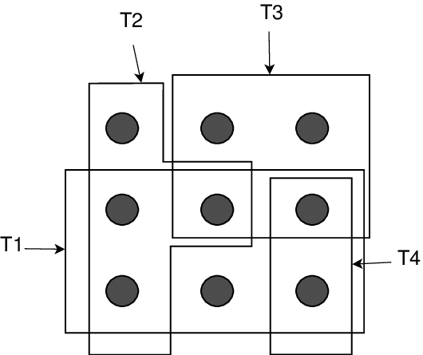

<!--proyect_tittle-->
# 🧠 Heurística para el Problema de Set Covering

<!--proyect_image1_proyect_markdown/image1.png-->

---

<!--proyect_subtitle_description-->
## ✨ Descripción del Proyecto

<!--proyect_content_description-->
Este proyecto implementa una heurística para resolver el problema de **Set Covering**, una técnica utilizada en optimización combinatoria. El objetivo es seleccionar un subconjunto mínimo de conjuntos que cubran todos los elementos requeridos, minimizando el costo total de la selección.

El algoritmo está desarrollado en Python y se basa en la lectura de datos desde un archivo externo (`reader1.txt`), donde se especifican los costos de cada conjunto y las relaciones de cobertura entre conjuntos y elementos. A partir de esta información, se construye una matriz binaria que representa qué conjunto cubre qué elemento, y se aplica una heurística de mejora iterativa para seleccionar los conjuntos más eficientes.

---

<!--proyect_subtitle_objective-->
## 🎯 Objetivo del Proyecto

<!--proyect_content_objective-->
El propósito principal es ofrecer una solución computacional que permita abordar el problema de cobertura de conjuntos de forma heurística, sin necesidad de métodos exactos o programación lineal. Esto es útil en escenarios donde se requiere una solución rápida y suficientemente buena, como en planificación logística, asignación de recursos o diseño de redes.

El proyecto busca ilustrar cómo se puede construir una solución modular que lea datos, los estructure en matrices, y aplique lógica de mejora basada en cobertura incremental y costo acumulado.

---

<!--proyect_subtitle_functionality-->
## 🧩 Funcionamiento General

<!--proyect_content_functionality-->
El flujo del programa se divide en varias etapas:

- **Importación de librerías:** Se utilizan módulos como `numpy`, `cmath`, `ctypes` y `multiprocessing.dummy` para operaciones matemáticas y estructurales.
- **Lectura de datos:** Se abre el archivo `reader1.txt` y se extraen las dimensiones (filas y columnas), los costos de cada conjunto y las relaciones de cobertura.
- **Inicialización de estructuras:** Se crean listas para almacenar los conjuntos (`sets`) y sus respectivos costos (`costos`), así como variables de control para el algoritmo.
- **Construcción de la matriz de cobertura:** Se asignan valores binarios (0 o 1) indicando si un conjunto cubre un elemento específico.
- **Aplicación de la heurística:** Se calcula el valor de mejora de cada conjunto (cantidad de elementos que cubre), se selecciona el conjunto con mayor mejora, se acumula su costo y se eliminan los elementos cubiertos para la siguiente iteración.
- **Finalización:** El proceso continúa hasta que todos los elementos estén cubiertos. Se muestra el costo total y se compara con un valor óptimo ingresado manualmente.

---

<!--proyect_subtitle_designUX-->
## 🖥️ Interfaz y Experiencia de Usuario

<!--proyect_content_designUX-->
El programa se ejecuta en consola, mostrando mensajes claros sobre el progreso del algoritmo, como la cantidad de filas y columnas, los conjuntos seleccionados y el costo acumulado. La interacción final permite al usuario ingresar un valor óptimo para comparar la eficiencia de la solución obtenida.

Aunque no cuenta con una interfaz gráfica, el diseño modular del código permite integrarlo fácilmente en sistemas visuales o dashboards si se desea extender su funcionalidad.

---

<!--proyect_subtitle_architecture-->
## 🏗️ Arquitectura Técnica

<!--proyect_content_architecture-->
La estructura del proyecto está organizada en bloques funcionales:

- **Lectura de archivo:** Extracción de datos desde `reader1.txt`.
- **Procesamiento de datos:** Conversión de texto en estructuras numéricas y matrices.
- **Construcción de cobertura:** Asignación binaria en la matriz `sets`.
- **Algoritmo heurístico:** Evaluación de mejoras, selección de conjuntos, actualización de cobertura.
- **Interacción final:** Comparación con valor óptimo y salida del ciclo.

Todo el código está contenido en un único script, lo que facilita su análisis, modificación y adaptación a otros lenguajes o entornos.

---

<!--proyect_subtitle_technologies-->
## 🔧 Tecnologías Utilizadas

<!--proyect_content_technologies-->
**Lenguaje de programación:**
- Python 3.x

**Librerías:**
- `numpy`  
- `cmath`  
- `ctypes`  
- `string`  
- `multiprocessing.dummy`

**Entrada de datos:**
- Archivo plano `.txt` estructurado por líneas y espacios

---

<!--proyect_subtitle_adminPanel-->
## 📂 Estructura de Datos

<!--proyect_content_adminPanel-->
El archivo de entrada contiene:

- Una línea con el número de filas (elementos) y columnas (conjuntos).
- Una línea con los costos de cada conjunto.
- Varias líneas que indican cuántos conjuntos cubren cada elemento y cuáles son.

El programa transforma esta información en:

- Una lista de costos (`costos`)
- Una matriz binaria (`sets`) que representa la cobertura
- Variables de control para iterar sobre los elementos y conjuntos

---

<!--proyect_subtitle_contact-->
## 📬 Contacto

<!--proyect_content_contact-->
**Correo electrónico:**
- vielmassalais023@gmail.com  
-  

**Teléfono:**
- +52 (81) 3233-1206 

**Redes Sociales:**
- GitHub: [@CesarVielmas](https://github.com/CesarVielmas)  
- LinkedIn: [Cesar Vielmas](https://www.linkedin.com/in/cesar-vielmas-324a9b218/)  

---

<!--proyect_subtitle_footer-->
## Heurística Set Covering

